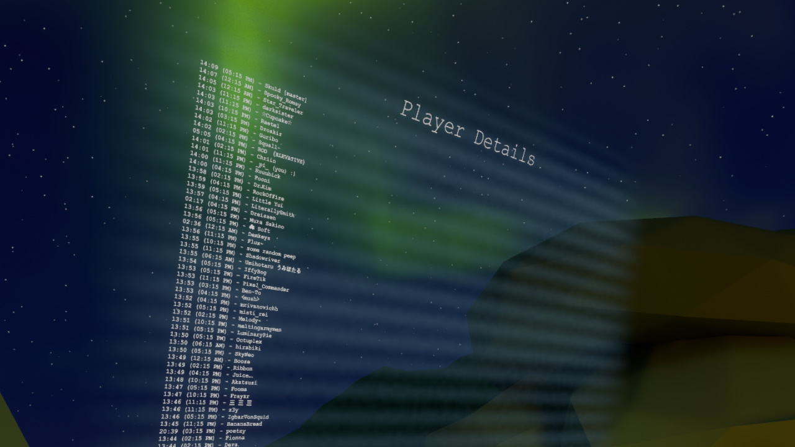
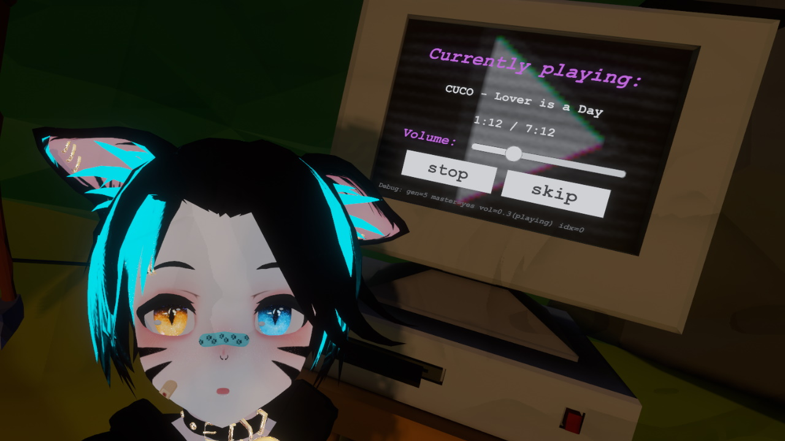
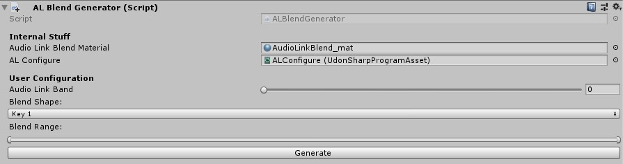
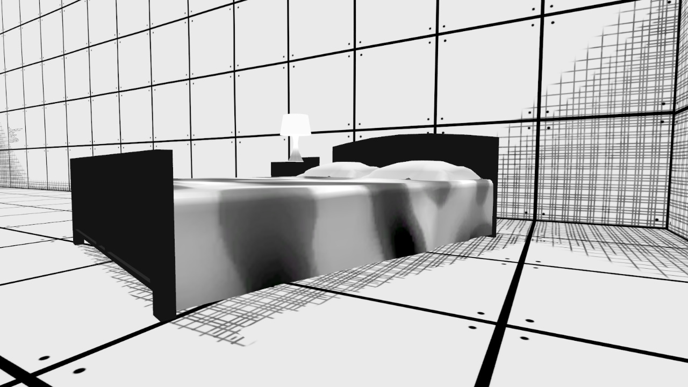

# \_pi\_'s random collection of VRChat assets
Stuff that I make sometimes. Might be useful, might not. If it blows up your computer, please send me a picture; I like fire.

For licensing see the bottom of this file. **TL;DR:** use in public worlds or avatars for free (but credit me somewhere plz), for commercial use (i.e. included in private commissions) contact me first.

You can see most/all of the prefabs shown here in this example world:  
https://vrchat.com/home/launch?worldId=wrld_52236eb8-d97b-4e6b-939f-ec3b7de350f8  
(no guarantees that I'll keep it up to date though)

## General Usage

The various things are provided as Unity packages. To use them, download the '.unitypackage' file, drag it into the Unity editor window and import all parts. This will create a folder under 'Assets/\_pi\_/' named after the package. In there you will find all necessary components, as well as usually a prefab titled '\_PREFAB' which is ready to be dragged into your scene.

## Dependencies
* [UdonSharp](https://github.com/MerlinVR/UdonSharp)
* [CyanEmu](https://github.com/CyanLaser/CyanEmu) (optional, but highly recommended)
* [AudioLink](https://github.com/llealloo/vrc-udon-audio-link) (for supported prefabs, usually noted explicitly)

# Udon Stuff

## Player List

Shows all players in the world, as well as their local time and how long they've been in the instance. Uses a manually allocated object pool for syncing - you should adjust the size to how many people fit in your world as follows:
* Place the prefab in your scene
  * note: if you want to change the size prefer "transform scale" to changing font size or canvas size, as the Udon code will try to adjust font size automatically based on player count
* Select "Unpack Prefab Completely" by right clicking the prefab in the Hierarchy
* Select the "SyncPool" game object and set "Instances" to *double* your max player count (i.e. to the hard limit of your world, you can add a few for good measure too, they don't hurt performance too much)
  * don't set "Instances" to 0 unless you like to watch the world burn
* Check "Do Work" while *not* in play mode

[Download](https://github.com/PiMaker/VRChatUnityThings/raw/main/PlayerList.unitypackage)

## Music Player

A fully synchronized music player. Features:
* Full late-joiner support
* Preloading for instant skip and no delay between songs
* Easy setup - just put the prefab in your world and add YouTube links (or any other supported source)
* Auto-randomized playlist, uses a one-time shuffle to avoid repeating songs over and over (note: works best with 5+ or so songs)

Note on AudioLink: I originally made this with AudioLink support, but decided against putting it in the package. It's quite a hassle to set up and requires you to patch the AudioLink Udon script yourself (since the player uses two AudioSources in an alternating fashion for instant-skip), but if you think you know what you're doing: there is some commented out code in MusicPlayerVideo.cs that you can use as a base for your AudioLink adventures.

[Download](https://github.com/PiMaker/VRChatUnityThings/raw/main/MusicPlayer.unitypackage)

## Dial

Dial in all the things. Supports smooth grab-turn in VR, and "click-to-advance" fallback for desktop. Not synced (for now).

Usage:
* Place in world
* Adjust text under "Labels" to your liking, set text to empty for 2 and/or 3 if you require less states
* On the UdonBehaviour on the prefab root you can configure the Dial to your liking:
  * States: how many states the dial should have, ranges from 2 (simple on/off) to 4 (model will adapt automatically)
  * Current State: starting state on world load (note: on loading, no events will be called, so make sure your world state matches this!)
  * Suspended State: if you put a trigger bounding box on the prefab root (make sure it's on the "MirrorReflections" layer if you do, otherwise VR interactions break!), this state will be automatically set whenever the local player leaves the area - useful for mirrors that turn off automatically when the player gets too far away
  * Enable/Disable: these GameObjects will be set active depending on the current state, i.e. index 0 will turn on in state 0, index 1 in state 1, etc...
  * Behaviours: more advanced than Enable/Disable, UdonBehaviours put into these slots will receive "DialEnable" and "DialDisable" events when necessary (note: if you want to know the "activating" state in such an event, read the "NextState" variable from the Dial, not "CurrentState"!)

[Download](https://github.com/PiMaker/VRChatUnityThings/raw/main/Dial.unitypackage)

## CamRig

Udon based 'dolly'-style camera rig, allows setting a spline-based camera path and have the camera follow it smoothly. Put your in-game stream camera into the rainbow box and set it to world space so you can record the camera's perspective from the VRChat desktop window. Will be slightly laggy for anyone that is not the current owner (can be changed by grabbing the red controller handle), so whoever is recording should be owner.

Licensing note: The DSLR camera model is provided by John Dinwiddie @ https://skfb.ly/6rBHA and might require seperate crediting when in use (or can be replaced with whatever model you want)

[Download](https://github.com/PiMaker/VRChatUnityThings/raw/main/CamRig.unitypackage)

## Audio Link Blend

AudioLink as easy as pi(e)! Makes regular blend shapes react to AudioLink channels, perfect for speakers and such. Performance optimized with baked meshes, so almost no overhead (no skinned meshes!).

To use, put your object as a regular skinned mesh in your scene, drag the "ALBlendGenerator" script onto it in the Inspector, optionally configure your settings, and click "Generate". You can click generate multiple times, with different AudioLink bands, and it will create multiple children, all reacting the the band you selected (detected via the object's name). The original skinned mesh renderer will be disabled, as to not waste performance. Adjust the "AudioLinkBlend_mat" material to change the look of your object (i.e. put textures on etc.), make as many copies as you like for different material styles (just place your copy into the slot under "Internal Settings" before hitting "Generate").

[Download](https://github.com/PiMaker/VRChatUnityThings/raw/main/AudioLinkBlend.unitypackage)

# Shader Stuff

## Aurora

Aurora Borealis? At this time of the year? Localized entirely within this GitHub repository? Yes, and it supports AudioLink! Place in your world, scale it so it fits across your entire map, and play around with the settings on the "Aurora_Mat" to get a feel for it! (note: has to be placed _high_ above your world, does not look good from too close)

Licensing note: Uses the simplex noise library from [here](https://gist.github.com/fadookie/25adf86ae7e2753d717c), which does not state a license, but it _sounds_ like the original poster in the Unity forums intended to share it for use anywhere - if anyone finds offense in my inclusion here, please contact me.

Debugging note: I found that in some instances quite extreme color banding can occur when testing with the "Build & Test" option - I don't know why it happens, but it works fine in the editor and also goes away once uploaded and viewed from a regular instance of VRChat.

[Download](https://github.com/PiMaker/VRChatUnityThings/raw/main/Aurora.unitypackage)

## Procedural Night Skybox

A somewhat "low-poly" style nighttime skybox. Comes in two variants:
* "Skybox" - fully dynamic, highly configurable, play around with the sliders and values to see what they do :)
* "SkyboxStatic" - static capture of "Skybox", not configurable once created, but supports Quest (note: it also has slightly less quality and does not seem to be faster on PC at all, so it is recommended to use "Skybox" if possible)

You can create a "SkyboxStatic" of your own configured variant easily (useful for PC & Quest maps, where PC can use the regular one and for Quest you capture it to look somewhat the same). To do so, place the "CapturePrefab" in your scene somewhere, check the "Dump" checkbox at the bottom, then go into play mode (click play at the top of the editor). This will update the "capture-N" images in the folder which will get applied to "SkyboxStatic" (you might need to click out and back in to the editor for changes to take effect after you leave play mode). You should remove the prefab from your scene afterwards.

[Download](https://github.com/PiMaker/VRChatUnityThings/raw/main/Skybox.unitypackage)

## Manga Shader

Real-time shadows in manga style. Somewhat anyway. I don't really read manga, okay?

The "MangaMaterial" is an example, play around with the settings yourself. I feel they're all quite self-explanatory (or at least I'm too lazy to explain them right now...).

Note about the "Fake Shadow" settings: You can use these to create fake spherical shadows on your materials for static objects that don't get lit by a dynamic light. To ease usage, the package comes with a script called "FakeShadowSphere.cs" which you can put on an empty game object and hit "Update" to set the object's position as a "Fake Shadow" entry for all instances of the manga shader in the scene.

[Download](https://github.com/PiMaker/VRChatUnityThings/raw/main/MangaShader.unitypackage)

# License
All assets in this repository are licensed under the terms of 'CC BY-NC-SA 2.0' unless explicitly otherwise marked. For exceptions contact me directly (see https://pimaker.at or Discord _pi#4219_). You can view a full copy of the license here: https://creativecommons.org/licenses/by-nc-sa/2.0/
