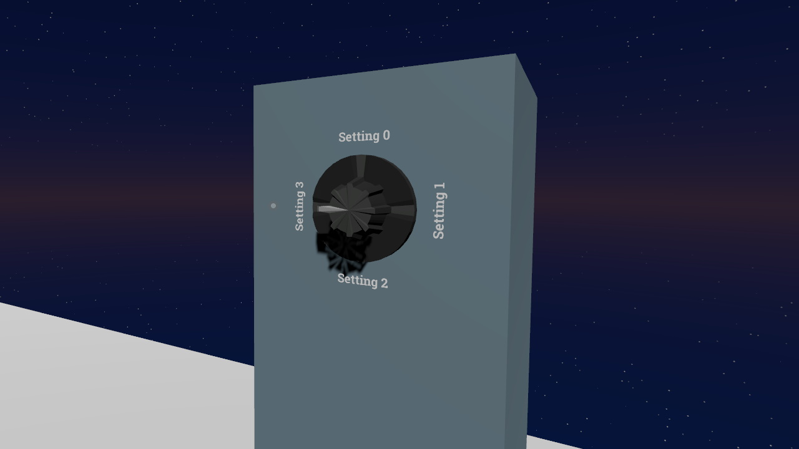
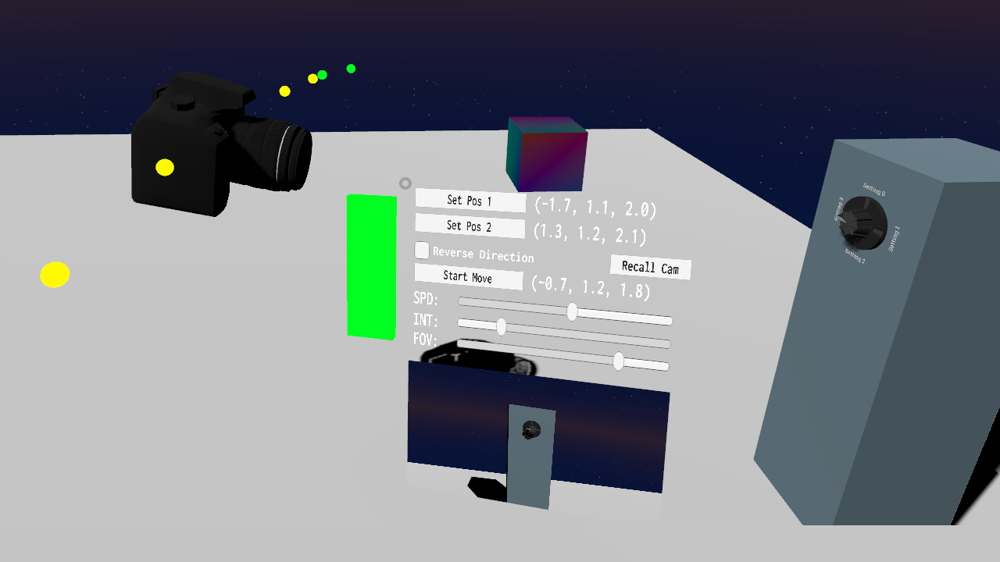
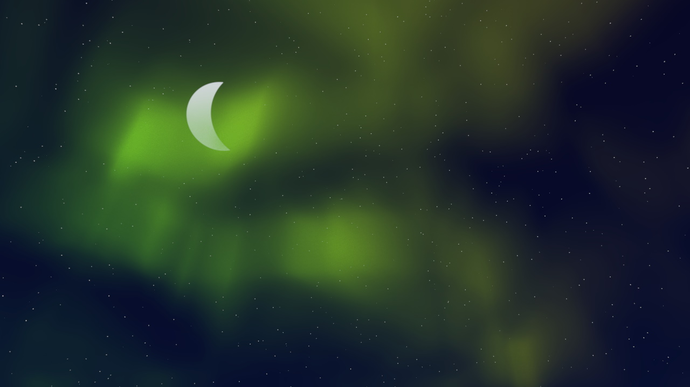
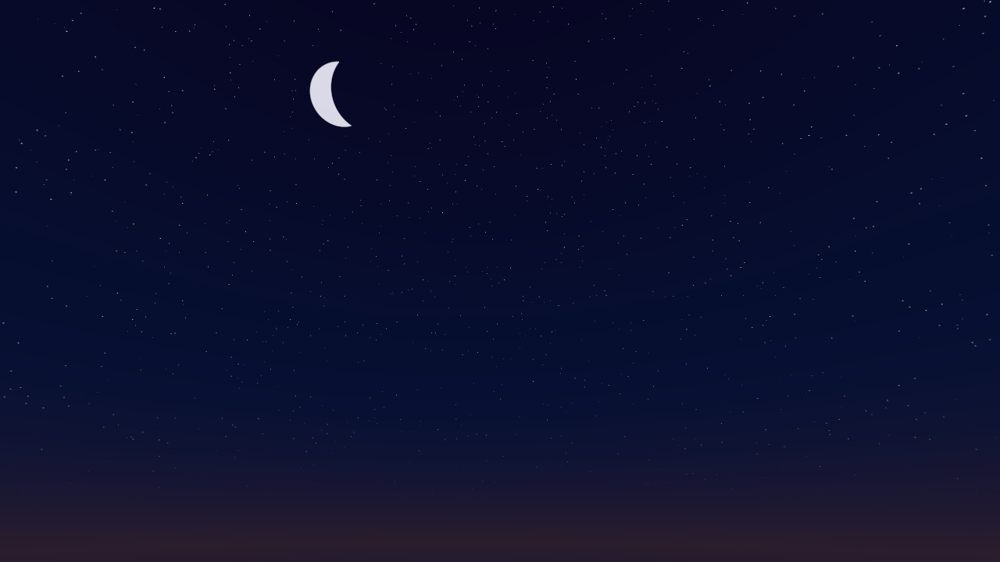

# \_pi\_'s random collection of VRChat assets
Stuff that I make sometimes. Might be useful, might not. If it blows up your computer, please send me a picture; I like fire.

For licensing see the bottom of this file. **TL;DR:** use in public worlds or avatars for free (but credit me somewhere plz), for commercial use (i.e. included in private commissions) contact me first.

## General Usage

The various things are provided as Unity packages. To use them, download the '.unitypackage' file, drag it into the Unity editor window and import all parts. This will create a folder under 'Assets/\_pi\_/' named after the package. In there you will find all necessary components, as well as usually a prefab titled '\_PREFAB' which is ready to be dragged into your scene.

# Udon Stuff

Basic Dependencies:
* [UdonSharp](https://github.com/MerlinVR/UdonSharp)
* [CyanEmu](https://github.com/CyanLaser/CyanEmu) (optional, but highly recommended)

## Dial

Dial in all the things. Supports smooth grab-turn in VR, and "click-to-advance" fallback for desktop. Not synced (for now).

Usage:
* Place in world
* Adjust text under "Labels" to your liking, set text to empty for 2 and/or 3 if you require less states
* On the UdonBehaviour on the prefab root you can configure the Dial to your liking:
  * States: how many states the dial should have, ranges from 2 (simple on/off) to 4 (model will adapt automatically)
  * Current State: starting state on world load (note: on loading, no events will be called, so make sure your world state matches this!)
  * Suspended State: if you put a trigger bounding box on the prefab root (make sure it's on the "MirrorReflections" layer if you do, otherwise VR interactions break!), this state will be automatically set whenever the local player leaves the area - useful for mirrors that turn off automatically when the player gets too far away
  * Enable/Disable: these GameObjects will be set active depending on the current state, i.e. index 0 will turn on in state 0, index 1 in state 1, etc...
  * Behaviours: more advanced than Enable/Disable, UdonBehaviours put into these slots will receive "DialEnable" and "DialDisable" events when necessary (note: if you want to know the "activating" state in such an event, read the "NextState" variable from the Dial, not "CurrentState"!)

[Download](https://github.com/PiMaker/VRChatUnityThings/raw/main/Dial.unitypackage)

## CamRig

Udon based 'dolly'-style camera rig, allows setting a spline-based camera path and have the camera follow it smoothly. Put your in-game stream camera into the rainbow box and set it to world space so you can record the camera's perspective from the VRChat desktop window. Will be slightly laggy for anyone that is not the current owner (can be changed by grabbing the red controller handle), so whoever is recording should be owner.

Licensing note: The DSLR camera model is provided by John Dinwiddie @ https://skfb.ly/6rBHA and might require seperate crediting when in use (or can be replaced with whatever model you want)

[Download](https://github.com/PiMaker/VRChatUnityThings/raw/main/CamRig.unitypackage)

# Shader Stuff

## Aurora

Aurora Borealis? At this time of the year? Localized entirely within this GitHub repository? Yes, and it supports AudioLink! Place in your world, scale it so it fits across your entire map, and play around with the settings on the "Aurora_Mat" to get a feel for it! (note: has to be placed _high_ above your world, does not look good from too close)

Licensing note: Uses the simplex noise library from [here](https://gist.github.com/fadookie/25adf86ae7e2753d717c), which does not state a license, but it _sounds_ like the original poster in the Unity forums intended to share it for use anywhere - if anyone finds offense in my inclusion here, please contact me.

[Download](https://github.com/PiMaker/VRChatUnityThings/raw/main/Aurora.unitypackage)

## Procedural Night Skybox

A somewhat "low-poly" style nighttime skybox. Comes in two variants:
* "Skybox" - fully dynamic, highly configurable, play around with the sliders and values to see what they do :)
* "SkyboxStatic" - static capture of "Skybox", not configurable once created, but supports Quest (note: it also has slightly less quality and does not seem to be faster on PC at all, so it is recommended to use "Skybox" if possible)

You can create a "SkyboxStatic" of your own configured variant easily (useful for PC & Quest maps, where PC can use the regular one and for Quest you capture it to look somewhat the same). To do so, place the "CapturePrefab" in your scene somewhere, check the "Dump" checkbox at the bottom, then go into play mode (click play at the top of the editor). This will update the "capture-N" images in the folder which will get applied to "SkyboxStatic" (you might need to click out and back in to the editor for changes to take effect after you leave play mode). You should remove the prefab from your scene afterwards.

[Download](https://github.com/PiMaker/VRChatUnityThings/raw/main/Skybox.unitypackage)

# License
All assets in this repository are licensed under the terms of 'CC BY-NC-SA 2.0' unless explicitly otherwise marked. For exceptions contact me directly (see https://pimaker.at or Discord _pi#4219_). You can view a full copy of the license here: https://creativecommons.org/licenses/by-nc-sa/2.0/
